  <h3><code>wiriya@github ~ $ ./contributions.sh</code></h3>
  
    
  <h3><code>wiriya@github ~ $ whoami</code></h3>
  <table>
    <tr>
      <td valign="top"></td>
      <td valign="top"></td>
    </tr>
  </table>

## Wiriya P.

AI Engineer working on **RAG systems and LLM agents**, with a focus on **Thai-language applications**.

I build retrieval systems that actually get used: routing between structured and
unstructured sources, retrievers tuned on real labeled queries, and agents that
decide where to look before they answer.

### What I work on

- **Retrieval-Augmented Generation** — hybrid SQL + vector pipelines, rerankers, evaluation harnesses
- **LLM agents** — routing and tool use with LangGraph
- **Thai NLP** — QA and summarization over Thai user-generated text
- **Fine-tuning** — LoRA / QLoRA adapters when a base model isn't enough

### Selected projects

| Project | What it does |
|---|---|
| [**Wongnai_QA**](https://github.com/wiriyabot/Wongnai_QA) | Thai restaurant QA over Wongnai reviews. Baseline vs. fine-tuned retriever, benchmarked side by side. LoRA adapter on Qwen2.5-7B. FastAPI + Streamlit. |
| [**AI-Agent-Hybrid-RAG**](https://github.com/wiriyabot/AI-Agent-Hybrid-RAG) | Enterprise data analyst that answers across SQL *and* customer reviews. A LangGraph router picks the source — or both. |
| [**llm_wiki**](https://github.com/wiriyabot/llm_wiki) | CLI that turns a pile of documents into a linked, embedded wiki. Ingest → synthesize → index → query, with a linter for orphans and stale embeddings. |
| [**RAG-Admin**](https://github.com/wiriyabot/RAG-Admin) | Course assistant with conversation memory. Modular loader / splitter / retriever / chain so pieces can be swapped. |

### Stack

`Python` · `LangChain` · `LangGraph` · `ChromaDB` · `FastAPI` · `Streamlit` · `PyTorch` · `Transformers` · `PEFT`
